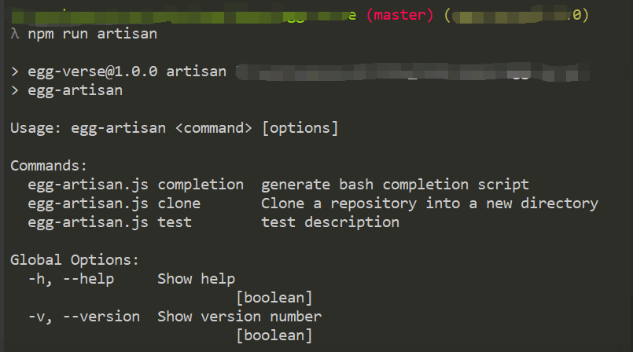
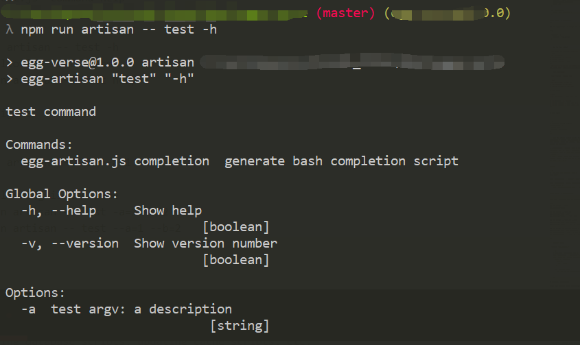
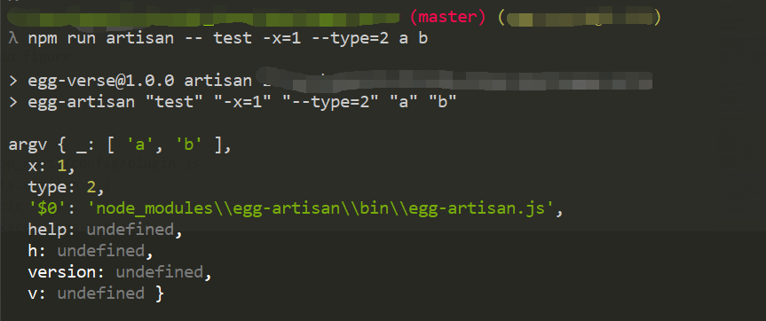

# egg-artisan

[![NPM version][npm-image]][npm-url]
[![build status][travis-image]][travis-url]
[![Test coverage][codecov-image]][codecov-url]
[![David deps][david-image]][david-url]
[![Known Vulnerabilities][snyk-image]][snyk-url]
[![npm download][download-image]][download-url]

[npm-image]: https://img.shields.io/npm/v/egg-artisan.svg?style=flat-square
[npm-url]: https://npmjs.org/package/egg-artisan
[travis-image]: https://img.shields.io/travis/zzzs/egg-artisan.svg?style=flat-square
[travis-url]: https://travis-ci.org/zzzs/egg-artisan
[codecov-image]: https://img.shields.io/codecov/c/github/zzzs/egg-artisan.svg?style=flat-square
[codecov-url]: https://codecov.io/github/zzzs/egg-artisan?branch=master
[david-image]: https://img.shields.io/david/zzzs/egg-artisan.svg?style=flat-square
[david-url]: https://david-dm.org/zzzs/egg-artisan
[snyk-image]: https://snyk.io/test/npm/egg-artisan/badge.svg?style=flat-square
[snyk-url]: https://snyk.io/test/npm/egg-artisan
[download-image]: https://img.shields.io/npm/dm/egg-artisan.svg?style=flat-square
[download-url]: https://npmjs.org/package/egg-artisan

A cli plugin for egg, named artisan, based on [common-bin](https://github.com/node-modules/common-bin).

## Install

```bash
$ npm i egg-artisan --save
```

## Mount

```js
// {app_root}/config/plugin.js
exports.artisan = {
  enable: true,
  package: 'egg-artisan',
};
```

## Features

> `egg-artisan` provides a cli running mode for egg. In the root directory, you can do something by executing commands like `npm run artisan xxx`, such as operating file, manipulating database scripts, updating cache scripts, etc.

`egg-artisan` based on [common-bin](https://github.com/node-modules/common-bin)(based on [yargs](https://github.com/yargs/yargs)), to provide more convenient usage, as detailed below.

## Usage

`egg-artisan` requires cli file to be stored in `app/artisan`, as shown below, `test.js`, `clone.js`.

```
    egg-project
    ├── app
    │   ├── artisan
    │   |   ├── test.js
    │   |   └── clone.js
    │   ├── controller
    |   ├── router.js
    |   | ...
    ├── package.json
    ├── config
    ├── test
    ├── app.js (可选)
    ├── ...

```

### How to write command
Let's take test.js as an example, for the file operation.

As you can see, the usage of the command is the same as that of `common-bin`, because `egg-artisan` extends `common-bin`. In addition, `egg-artisan` injected **`ths.ctx`** into the run method, so you can get anonymous context with **`ths.ctx`**.

You can see [common-bin](https://github.com/node-modules/common-bin), [http://yargs.js.org/docs](http://yargs.js.org/docs) for more detail.
```js

// {app_root}/app/artisan/test.js

'use strict';

const Command = require('egg-artisan');

class TestCommand extends Command {
  constructor(rawArgv) {
    super(rawArgv);
    this.yargs.usage('test command');

    this.yargs.options({
      a: {
        type: 'string',
        description: 'test argv: a description',
      },
    });
  }

  async run({ argv }) {
    const aa = argv.a || '';
    const bb = argv.b || '';
    const cc = argv._.join(',');
    await this.ctx.service.file.write(`argv: ${aa}${bb}${cc}`);
    const con = await this.ctx.service.file.read();
    console.log('argv', argv);
    return con;
  }

  get description() {
    return 'test description';
  }
}

module.exports = TestCommand;
```

### Add `egg-artisan` to package.json scripts:

```js
{
  "scripts": {
    "artisan": "egg-artisan"
  }
}
```

### Run the test command

- Show help, the following image has 2 custom commands: `test.js`, `clone.js`.
```bash
$ npm run artisan
// The following is the same
// npm run artisan -- -h
// npm run artisan -- help
```
> Why use `--` ? you can see [http://www.ruanyifeng.com/blog/2016/10/npm_scripts.html](http://www.ruanyifeng.com/blog/2016/10/npm_scripts.html).

    

- Show `test.js` command help
```bash
$ npm run artisan -- test -h
// The following is the same
// npm run artisan -- test help
```


- Run `test.js` command
```bash
$ npm run artisan -- test -x=1 --type=2 a b

// The following is the same
// npm run artisan -- test -x=1 --type 2 a b
// npm run artisan -- test -x 1 --type 2 a b
```



### Call the artisan command inside the project
`egg-artisan` provides `app.runArtisan(artisanCommand, [argvs])` for running some commands inside the project. `app.runArtisan(artisanName, [argvs])` accepts two parameters:
 
 - artisanCommand: Relative path or absolute path in the app/artisan directory, such as `test`, `{app_root}/app/artisan/test`; You can also append parameters, such as `test -x=1 --type=2`, `{app_root}/app/artisan/test -x=1 --type=2`.
 - argvs: command argvs, will be parsed and appended to `artisanCommand`. support object, array, such as `[ 'a', 'b' ]`, `{ '--a': 1, '--b': 2 }`, `{ a: true, '--b': 2 }`.


Example:

```js
// {app_root}/app/controller/home.js 
'use strict';

const BaseController = require('./base');

class HomeController extends BaseController {
  async index() {
    await this.app.runArtisan('test', { '-a': 1 })
}

module.exports = HomeController;
```

more usage, reference `npm run artisan`:

```js
npm run artisan -- test
app.runArtisan('test')

npm run artisan -- test -a=1
app.runArtisan('test -a=1')
app.runArtisan('test', { '-a': 1 })

npm run artisan -- test a b
app.runArtisan('test a b')
app.runArtisan('test', [ 'a', 'b' ])

npm run artisan -- test -a=1 --bb=2
app.runArtisan('test -a=1 --bb=2')
app.runArtisan('test', { '-a': 1, '--bb': 2 })

npm run artisan -- test -a=1 --bb=2 cc
app.runArtisan('test -a=1 --bb=2 cc')
app.runArtisan('test -a=1', { '--bb': 2, cc: true })
app.runArtisan('test', { '-a': 1, '--bb': 2, cc: true })

```

### advanced usage

- Combined `egg-schedule`

    ```js
    // {app_root}/app/schedule/xxx.js
    const Subscription = require('egg').Subscription;
    class ClusterTask extends Subscription {
      static get schedule() {
        return {
          type: 'custom',
        };
      }
      async subscribe(data) {
        await this.ctx.app.runArtisan('test', { '-a': 1 });
      }
    }
    ```

## Questions & Suggestions

Please open an issue [here](https://github.com/zzzs/egg/issues).

## License

[MIT](LICENSE)
